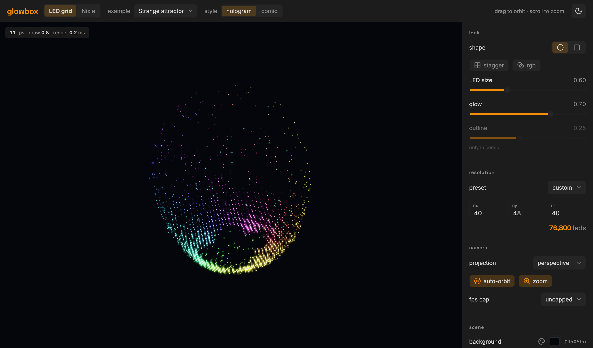
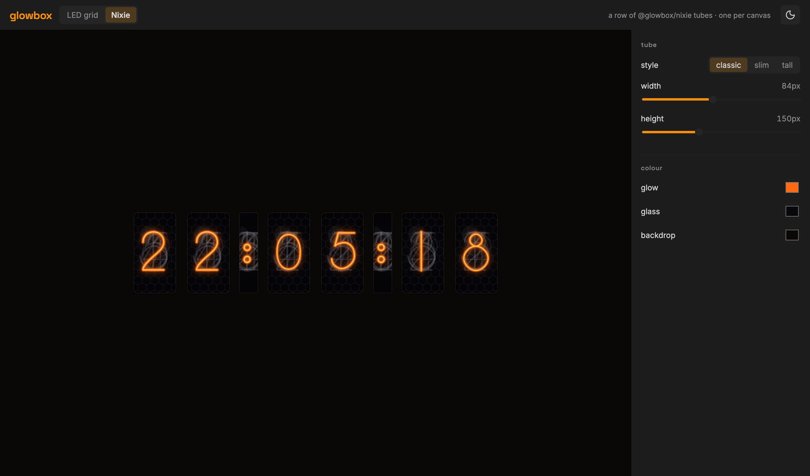

# glowbox

**▶ [Live demo](https://eetu.github.io/glowbox/)** — the interactive playground, in your browser.

A generic **3D LED-grid display** — an nx×ny×nz lattice of glowing "LEDs" you
draw on like a tiny 3D canvas, rendered in WebGL and orbitable (auto-spin +
drag). Ships as a **framework-agnostic core** plus thin framework wrappers you
install into any SPA.



**Live demos:** <https://eetu.github.io/glowbox/> — a spinning torus, a strange
attractor, a voxelized X-wing model, a wave field, a GIF billboard, a text
ticker, rain, a wormhole fly-through, and a self-playing 3D Pac-Man, plus a
nixie-tube clock — flat 2D tubes or a 3D wire-cathode-in-glass scene — on the
`/nixie` route.

## Packages

| package                                  | install                      | what it is                                                     |
| ---------------------------------------- | ---------------------------- | -------------------------------------------------------------- |
| [`@glowbox/led-grid`](packages/led-grid) | `yarn add @glowbox/led-grid` | plain-TS WebGL display + voxel API (zero deps)                 |
| [`@glowbox/nixie`](packages/nixie)       | `yarn add @glowbox/nixie`    | nixie-tube display core: glowing vector numerals (2D canvas)   |
| [`@glowbox/svelte`](packages/svelte)     | `yarn add @glowbox/svelte`   | Svelte 5 components: `<LedGrid>` + `<NixieTube>`               |
| [`@glowbox/react`](packages/react)       | `yarn add @glowbox/react`    | React components: `<LedGrid>` + `<NixieTube>` (`^18 \|\| ^19`) |
| [`@glowbox/vue`](packages/vue)           | `yarn add @glowbox/vue`      | Vue 3 components: `<LedGrid>` + `<NixieTube>`                  |
| [`@glowbox/extras`](packages/extras)     | `yarn add @glowbox/extras`   | content helpers: GIF / image player + text                     |

Two rendering cores — the 3D LED grid (`@glowbox/led-grid`) and the nixie tube
(`@glowbox/nixie`) — and each framework package (`svelte`/`react`/`vue`) ships a thin
component for **both** (`<LedGrid>` + `<NixieTube>`), with room for more cores later.
`@glowbox/extras` layers content (GIF/image animation, text) on the core's draw API.



## Quickstart

```svelte
<script lang="ts">
	import { LedGrid } from '@glowbox/svelte';
	import type { LedDisplay } from '@glowbox/led-grid';

	const draw = (d: LedDisplay) => {
		d.clear();
		d.sphere([4, 4, 4], 3, '#00aaff'); // Color: CSS string or [r,g,b] 0..1 (>1 blooms)
	};
</script>

<LedGrid
	size={[8, 8, 8]}
	{draw}
	led={{ glow: 3, offColor: '#0a0a12' }}
	camera={{ autoOrbit: true, projection: 'perspective' }}
	color={{ background: '#000', gain: 1.1 }}
	interaction={{ zoom: true }}
/>
```

The same component ships for [React](packages/react) and [Vue](packages/vue) with the
same props (instance access follows each framework's idiom: an `oncreate` callback in
Svelte, a forwarded `ref` in React, an `expose()`d handle in Vue). Colours, glow, LED size, `stagger` (brick lattice), camera,
projection, zoom, pause and more are all customizable via grouped options (`led`
`color` `camera` `interaction` `quality`) that update live — see
[`@glowbox/led-grid`](packages/led-grid) for the full list and defaults, or use the core
directly on a canvas. LEDs render as real emitters (bright cores + glow halos,
tone-mapped) so they read on any background. The display resizes in place and recovers
from WebGL context loss on its own.

## This repo

A Yarn-workspaces monorepo. Yarn is **vendored** (`.yarn/releases/*.cjs`,
invoked via `node` — no corepack).

```text
packages/led-grid        @glowbox/led-grid  — the framework-agnostic library
packages/svelte          @glowbox/svelte    — the Svelte wrapper
packages/react           @glowbox/react     — the React wrapper
packages/vue             @glowbox/vue       — the Vue 3 wrapper
packages/extras          @glowbox/extras    — content helpers (GIF/image/text)
packages/nixie           @glowbox/nixie     — nixie-tube rendering core (2D canvas)
examples/svelte-gallery  the demo SPA (voxel gallery + a /nixie clock) → GitHub Pages
```

```sh
node .yarn/releases/yarn-*.cjs install   # or: yarn install (if yarn is on PATH)
yarn dev        # run the demo gallery (Vite, :5173) against the library source
yarn build      # build all packages (led-grid → nixie → svelte/react/vue/extras) + the demo
yarn test       # vitest (node + headless-chromium browser) + Playwright e2e
yarn validate   # lint + format + typecheck + test
yarn size       # bundle-size budgets (size-limit; minified + brotli) on the shipped bundles
```

The demo resolves `@glowbox/*` to package **source** (via `kit.alias`), so dev
and typecheck need no prior build; the packages are validated independently by
their own `build`/`test`.

## Publishing

All six packages publish to the public npm registry under the `@glowbox` scope. Tag
a release (`vX.Y.Z`) and the `release` workflow publishes each via **npm trusted
publishing (OIDC)** with provenance — no `NPM_TOKEN` secret (led-grid first, then the
wrappers + extras + nixie). Each package needs a trusted publisher configured on npm.

## License

MIT — see [LICENSE](LICENSE).
