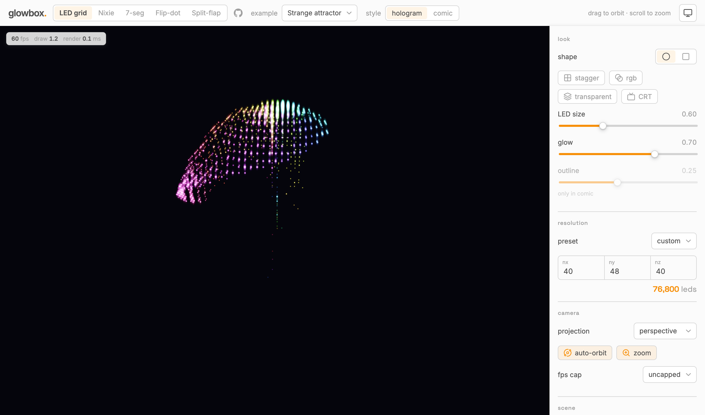
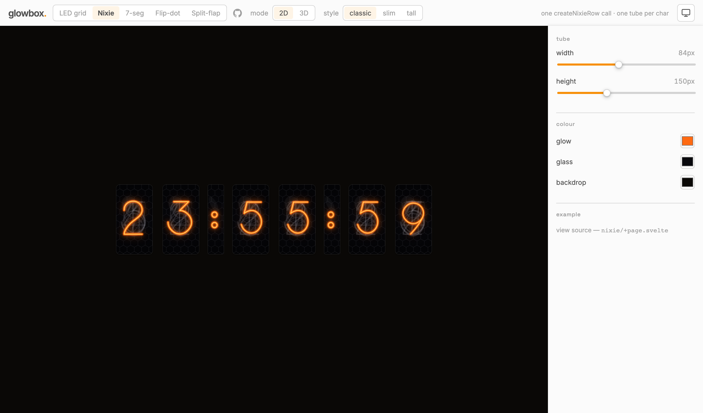
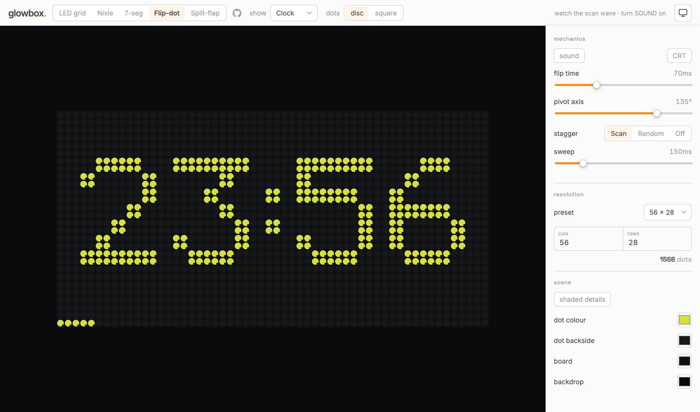
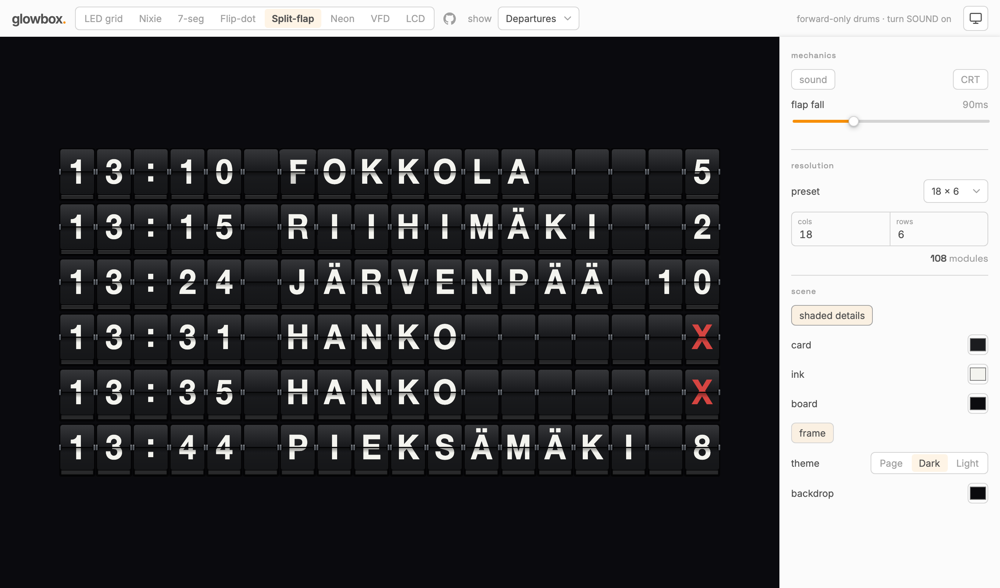
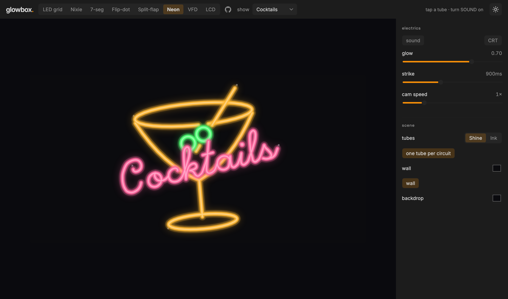

# glowbox

**▶ [Live demo](https://eetu.github.io/glowbox/)** — the interactive playground, in your browser.
**⚡ Try it now:** [Svelte](https://stackblitz.com/github/eetu/glowbox/tree/main/examples/starters/svelte) ·
[React](https://stackblitz.com/github/eetu/glowbox/tree/main/examples/starters/react) ·
[Vue](https://stackblitz.com/github/eetu/glowbox/tree/main/examples/starters/vue) — editable StackBlitz starters, no install.

Glowing retro **display components**: a generic **3D LED-grid display** — an
nx×ny×nz lattice of glowing "LEDs" you draw on like a tiny 3D canvas, rendered
in WebGL and orbitable (auto-spin + drag + zoom) — plus five 2D-canvas cores:
a **nixie tube**, a **seven-segment digit**, an **electromechanical flip-dot
board** (discs physically rotate, and click), a **split-flap (Solari)
display** (flap cards fall from a drum, and clack), and a **neon sign** (text
bent into glass tubes that strike, flicker, hum and age). All ship as
**framework-agnostic cores** plus thin framework wrappers you install into any
SPA.



**Live demos:** <https://eetu.github.io/glowbox/> — a spinning torus, a strange
attractor, a voxelized X-wing model, a wave field, a GIF billboard, a text
ticker, rain, a wormhole fly-through, and a self-playing 3D Pac-Man, plus a
nixie-tube clock — flat 2D tubes or a 3D wire-cathode-in-glass scene — on the
`/nixie` route, an ageing seven-segment clock on `/seven`, a flip-dot board with
a solenoid rattle on `/flipdot`, a split-flap departures board — with chroma
image drums, matrix rain, snake and pong — on `/splitflap`, and a neon sign —
cursive glass power-cycling through its strike sequence, a worn NO / VACANCY,
a gas tour, the tired transformer — on `/neon`.

## Packages

| package                                            | install                           | what it is                                                                |
| -------------------------------------------------- | --------------------------------- | ------------------------------------------------------------------------- |
| [`@glowbox/led-grid`](packages/led-grid)           | `yarn add @glowbox/led-grid`      | plain-TS WebGL display + voxel API (zero deps)                            |
| [`@glowbox/nixie`](packages/nixie)                 | `yarn add @glowbox/nixie`         | nixie-tube display core: glowing vector numerals (2D canvas)              |
| [`@glowbox/seven-segment`](packages/seven-segment) | `yarn add @glowbox/seven-segment` | seven-segment display core: per-segment dynamics, ageing, LED/VFD         |
| [`@glowbox/flip-dot`](packages/flip-dot)           | `yarn add @glowbox/flip-dot`      | flip-dot board core: physical disc flips, dithering, solenoid click       |
| [`@glowbox/split-flap`](packages/split-flap)       | `yarn add @glowbox/split-flap`    | split-flap (Solari) core: drum cascades, chroma image drums, card slap    |
| [`@glowbox/neon`](packages/neon)                   | `yarn add @glowbox/neon`          | neon-sign core: glass tubes, strike sequences, wear, hum, light-theme ink |
| [`@glowbox/crt`](packages/crt)                     | `yarn add @glowbox/crt`           | composable CRT screen over any canvas: curvature, phosphor persistence    |
| [`@glowbox/svelte`](packages/svelte)               | `yarn add @glowbox/svelte`        | Svelte 5 components, one per core (`<LedGrid>` … `<NeonSign>`)            |
| [`@glowbox/react`](packages/react)                 | `yarn add @glowbox/react`         | React components: the same six (`^18 \|\| ^19`)                           |
| [`@glowbox/vue`](packages/vue)                     | `yarn add @glowbox/vue`           | Vue 3 components: the same six                                            |
| [`@glowbox/extras`](packages/extras)               | `yarn add @glowbox/extras`        | content: GIF/image players, 5×7 LED font text + scroller                  |

Six rendering cores — the 3D LED grid (`@glowbox/led-grid`), the nixie tube
(`@glowbox/nixie`), the seven-segment display (`@glowbox/seven-segment`), the
flip-dot board (`@glowbox/flip-dot`), the split-flap display
(`@glowbox/split-flap`) and the neon sign (`@glowbox/neon`) — and each
framework package (`svelte`/`react`/`vue`) ships a thin component for **all of
them** (`<LedGrid>` + `<NixieTube>` + `<SevenSegment>` + `<FlipDots>` +
`<SplitFlap>` + `<NeonSign>`).
`@glowbox/extras` layers content (GIF/image animation, text, audio bands) on the core's
draw API, and `@glowbox/crt` is the first _effects layer_ — slap a curved phosphor
screen over any of them (or any canvas at all).









## Quickstart

```svelte
<script lang="ts">
	import { LedGrid } from '@glowbox/svelte';
	import type { LedDisplay } from '@glowbox/led-grid';

	const draw = (d: LedDisplay) => {
		d.clear();
		d.sphere([4, 4, 4], 3, '#00aaff'); // Color: CSS string or [r,g,b] 0..1 (>1 blooms)
	};
</script>

<LedGrid
	size={[8, 8, 8]}
	{draw}
	led={{ glow: 3, offColor: '#0a0a12' }}
	camera={{ autoOrbit: true, projection: 'perspective' }}
	color={{ background: '#000', gain: 1.1 }}
	interaction={{ zoom: true }}
/>
```

The same component ships for [React](packages/react) and [Vue](packages/vue) with the
same props (instance access follows each framework's idiom: an `oncreate` callback in
Svelte, a forwarded `ref` in React, an `expose()`d handle in Vue). Colours, glow, LED size, `stagger` (brick lattice), camera,
projection, zoom, pause and more are all customizable via grouped options (`led`
`color` `camera` `interaction` `quality`) that update live, and the voxel API draws
`line` / `box` / `sphere` / `torus` / `cylinder` primitives — see
[`@glowbox/led-grid`](packages/led-grid) for the full list and defaults, or use the core
directly on a canvas. LEDs render as real emitters (bright cores + glow halos,
tone-mapped) so they read on any background. The display resizes in place and recovers
from WebGL context loss on its own.

## This repo

A Yarn-workspaces monorepo. Yarn is **vendored** (`.yarn/releases/*.cjs`,
invoked via `node` — no corepack).

```text
packages/led-grid        @glowbox/led-grid  — the framework-agnostic library
packages/svelte          @glowbox/svelte    — the Svelte wrapper
packages/react           @glowbox/react     — the React wrapper
packages/vue             @glowbox/vue       — the Vue 3 wrapper
packages/extras          @glowbox/extras    — content helpers (GIF/image/text)
packages/nixie           @glowbox/nixie     — nixie-tube rendering core (2D canvas)
packages/seven-segment   @glowbox/seven-segment — seven-segment rendering core (2D canvas)
packages/flip-dot        @glowbox/flip-dot  — flip-dot board rendering core (2D canvas)
packages/split-flap      @glowbox/split-flap — split-flap rendering core (2D canvas)
packages/neon            @glowbox/neon      — neon-sign rendering core (2D canvas)
packages/crt             @glowbox/crt       — composable CRT screen effect (WebGL pass)
examples/svelte-gallery  the demo SPA (LED gallery + nixie/seven/flipdot/splitflap/neon) → GitHub Pages
```

```sh
node .yarn/releases/yarn-*.cjs install   # or: yarn install (if yarn is on PATH)
yarn dev        # run the demo gallery (Vite, :5173) against the library source
yarn build      # build all packages (cores → wrappers/extras) + the demo
yarn test       # vitest (node + headless-chromium browser) + Playwright e2e
yarn validate   # lint + format + typecheck + test
yarn size       # bundle-size budgets (size-limit; minified + brotli) on the shipped bundles
```

The demo resolves `@glowbox/*` to package **source** (via `kit.alias`), so dev
and typecheck need no prior build; the packages are validated independently by
their own `build`/`test`.

## Publishing

All ten packages publish to the public npm registry under the `@glowbox` scope. Tag
a release (`vX.Y.Z`) and the `release` workflow publishes each via **npm trusted
publishing (OIDC)** with provenance — no `NPM_TOKEN` secret (the cores first, then
the wrappers + extras). Each package needs a trusted publisher configured on npm.

## License

MIT — see [LICENSE](LICENSE).
